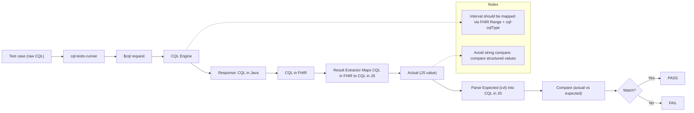

# cql-tests-runner

[](https://cql-tests-runner.quality.hl7.org)
[](https://github.com/cqframework/cql-tests-runner/graphs/contributors)
[](https://github.com/cqframework/cql-tests-runner/graphs/commit-activity)
[](https://github.com/cqframework/cql-tests-runner)
[](https://hub.docker.com/r/hlseven/quality-cql-tests-runner)
[](https://hub.docker.com/r/hlseven/quality-cql-tests-runner)
[](https://hub.docker.com/r/hlseven/quality-cql-tests-runner)


Test Runner for the [CQL Tests](https://github.com/cqframework/cql-tests) repository. This node application allows you to run the tests in the CQL Tests repository against a server of your choice using the [$cql](https://hl7.org/fhir/uv/cql/OperationDefinition-cql-cql.html) operation. The runner in its current state uses only this operation, and there is no expectation of any other FHIR server capability made by this runner. Additional capabilities may be required in the future as we expand the runner to support full Library/$evaluate as well. None of the tests in the repository have any expectation of being able to access data (i.e. the tests have no retrieve expressions).

The application runs all the tests in the repository and outputs the results as a JSON file in the `results` directory. If the output directory does not exist, it will be created.

Results output from running these tests can be posted to the [CQL Tests Results](https://github.com/cqframework/cql-tests-results) repository.

## Setting up the Environment

This application requires Node v25 and makes use of the [Axios](https://axios-http.com/docs/intro) framework for HTTP request/response processing. [Node Download](https://nodejs.org/en/download)

Install application dependencies using

```sh
npm install
```

### CQL Tests Submodule

The cql-tests folder has been added as a submodule. After pulling, you'll find a cql-tests folder inside cql-tests-runner. However, when you peek inside that folder, depending on your Git version, you might see nothing. Newer versions of Git will handle this automatically, but older versions may require you to explicitly instruct Git to download the contents of cql-tests.

```bash
git submodule update --init --recursive
```

### Configuration Settings

Configuration settings are set in a JSON configuration file. The file `conf/localhost.json` provides a sample configuration.

The authoritative definition of the configuration is the JSON Schema at
[`assets/schema/cql-test-configuration.schema.json`](assets/schema/cql-test-configuration.schema.json).
Configuration files are validated against it at load time, and it is also served over MCP as the
`cql-test-configuration-schema` resource. The reference table below explains what each setting
actually does; the schema is the place to look for the exact types and required fields.

```json
{
  "FhirServer": {
    "BaseUrl": "https://fhirServerBaseUrl",
    "CqlOperation": "$cql"
  },
  "Build": {
    "CqlFileVersion": "1.0.000",
    "CqlOutputPath": "./cql",
    "CqlVersion": "1.5",
    "testsRunDescription": "Local host test run",
    "cqlTranslator": "Java CQFramework Translator",
    "cqlTranslatorVersion": "Unknown",
    "cqlEngine": "Java CQFramework Engine",
    "cqlEngineVersion": "4.1.0"
  },
  "Tests": {
    "ResultsPath": "./results",
    "SkipList": []
  },
  "Debug": {
    "QuickTest": true
  }
}
```

#### Configuration Reference

`FhirServer` — where and how tests are evaluated.

| Setting | Required | Default | What it does |
| --- | --- | --- | --- |
| `BaseUrl` | yes | `https://cloud.alphora.com/sandbox/r4/cds/fhir` | Base URL of the FHIR server under test. A trailing slash is stripped on load. Combined with `CqlOperation` to form the request URL: `<BaseUrl>/$cql` or `<BaseUrl>/Library/$evaluate`. |
| `CqlOperation` | yes | `$cql` | Which operation evaluates the tests. One of `$cql` (system-level) or `$evaluate` (`Library/$evaluate`). |
| `ogBaseUrl` | no | — | Accepted by the schema and set in `conf/smile-cdr-local.json`, but **not read by any code**. Retained for backward compatibility; setting it has no effect. |

`Build` — CQL generation settings, plus provenance recorded in the results report.

| Setting | Required | Default | What it does |
| --- | --- | --- | --- |
| `CqlFileVersion` | yes | `1.0.000` | The version literal written into the `library` declaration of each `.cql` file produced by the `build-cql` command — `CqlFileVersion: "1.0.000"` yields `library CqlAggregateTest version '1.0.000'`. It has **no effect on running tests**, and is unrelated to the CQL language version (see `CqlVersion`). Only `build-cql` reads it. |
| `CqlOutputPath` | yes | `./cql` | Directory `build-cql` writes generated `.cql` files to. The `build-cql` CLI output argument takes precedence. |
| `CqlVersion` | no | `1.5` | The CQL language version the target engine implements. Drives version gating: tests carrying a `version`/`versionTo` outside this are skipped rather than run (for example the CQL 2.0 `Slice` tests are skipped against a 1.5 engine). |
| `testsRunDescription` | no | — | Free-text label for the run, copied into the results report. |
| `cqlTranslator` | no | `Unknown` | Name of the translator under test. Recorded in the results report only. |
| `cqlTranslatorVersion` | no | `Unknown` | Version of the translator. Recorded in the results report only. |
| `cqlEngine` | no | `Unknown` | Name of the engine under test. Recorded in the results report only. |
| `cqlEngineVersion` | no | `Unknown` | Version of the engine. Recorded in the results report only. |

`Tests` — which tests run and where results land.

| Setting | Required | Default | What it does |
| --- | --- | --- | --- |
| `ResultsPath` | yes | `./results` | Directory the results JSON is written to. The CLI output argument takes precedence. |
| `SkipList` | yes | `[]` | Tests to skip, each `{ testsName, groupName, testName, reason }`. Skipped tests appear in the results with status `skip` and the given reason. See below. |
| `OnlyList` | no | `[]` | If non-empty, only these tests run and all others are skipped, each `{ testsName, groupName, testName }`. See below. |

`Debug` — development aids.

| Setting | Required | Default | What it does |
| --- | --- | --- | --- |
| `QuickTest` | yes | `false` | Smoke-test mode. When `true`, loading stops after the **first group of the first test file**, so only a handful of tests run. Use it to check connectivity to a server, not to assess conformance. Equivalent to the `--quick` CLI flag. |

To skip tests, add entries to the `SkipList` with the corresponding `testsName`, `groupName`, `testName`, and `reason`.

```jsonc
{
  "FhirServer": {/* omitted */},
  "Build": {/* omitted */},
  "Tests": {
    "ResultsPath": "./results",
    "SkipList": [
      {
        "testsName": "CqlAggregateTest",
        "groupName": "AggregateTests",
        "testName": "RolledOutIntervals",
        "reason": "CQLtoELM - Could not resolve identifier MedicationRequestIntervals in the current library"
      },
      // add more tests to skip as necessary...
    ]
  },
  "Debug": {/* ommitted */}
}
```

To run only a specified set of tests (and skip all others), add entries to the `OnlyList` with the corresponding `testsName`, `groupName`, and `testName`.

```jsonc
{
  "FhirServer": {/* omitted */},
  "Build": {/* omitted */},
  "Tests": {
    "ResultsPath": "./results",
    "SkipList": [],
    "OnlyList": [
      {
        "testsName": "CqlAggregateTest",
        "groupName": "AggregateTests",
        "testName": "RolledOutIntervals"
      },
      // add more tests to only run as necessary...
    ]
  },
  "Debug": {/* ommitted */}
}
```

Create your own configuration file and reference it when running the commands. You can use `conf/localhost.json` as a template for a new configuration with your own settings.

### Running the tests

The CLI now requires a configuration file path as an argument. Run the tests with the following commands:

#

### Running from Source Code

To run the application directly from source:

```bash
# Install dependencies
npm install

# Initialize the cql-tests submodule
git submodule update --init --recursive

# Run commands directly from TypeScript source
npx tsx src/bin/cql-tests.ts run-tests conf/development.json ./results # Run CQL tests
npx tsx src/bin/cql-tests.ts run-tests conf/development.json ./results --quick # Run with quick test mode enabled
npx tsx src/bin/cql-tests.ts server                               # Run in server API mode
npx tsx src/bin/cql-tests.ts help                               # Hetailed command help

npx tsx src/bin/cql-tests.ts build-cql conf/development.json ./cql    # Unused legacy tool

```

### Running from Pre-Built OCI/Docker Image

The application is available as the pre-built image tag `hlseven/quality-cql-tests-runner:latest`.

#### Using the Docker Image

By default, the image runs the CLI. When you bind in any local directories (such as configuration and results directories) you may use it as you would any other command line utility.

```bash
# Run CQL tests with a configuration file
docker run --rm -v $(pwd)/conf:/app/conf -v $(pwd)/results:/app/results \
  hlseven/quality-cql-tests-runner:latest run-tests conf/localhost.json ./results

# Run CQL tests with quick test mode enabled
docker run --rm -v $(pwd)/conf:/app/conf -v $(pwd)/results:/app/results \
  hlseven/quality-cql-tests-runner:latest run-tests conf/localhost.json ./results --quick

# Build CQL libraries (Unused)
docker run --rm -v $(pwd)/conf:/app/conf -v $(pwd)/cql:/app/cql \
  hlseven/quality-cql-tests-runner:latest build-cql conf/localhost.json ./cql

# Start in REST server mode listening on port 3000.
docker run --rm -p 3000:3000 -v $(pwd)/conf:/app/conf \
  hlseven/quality-cql-tests-runner:latest server

# Using host networking to test against a server running on the host machine
docker run --rm --network host -v $(pwd)/conf:/app/conf -v $(pwd)/results:/app/results \
  hlseven/quality-cql-tests-runner:latest run-tests conf/localhost.json ./results
```

#### Building the Docker Image

```bash
# Build the Docker image locally
docker build -t cql-tests-runner .

# Build multi-platform image for distribution
docker buildx build --platform linux/arm64,linux/amd64 -t hlseven/quality-cql-tests-runner:latest .

# Run with built image
docker run --rm -v $(pwd)/conf:/app/conf -v $(pwd)/results:/app/results hlseven/quality-cql-tests-runner:latest run-tests conf/localhost.json ./results

# Using host networking with built image
docker run --rm --network host -v $(pwd)/conf:/app/conf -v $(pwd)/results:/app/results hlseven/quality-cql-tests-runner:latest run-tests conf/localhost.json ./results
```

#### Environment Variable Overrides

You can still override specific settings using environment variables:

```sh
export SERVER_BASE_URL=http://fhirServerBaseEndpoint
export CQL_OPERATION=$cql
export CQL_TESTS_PATH=cql-tests/tests/cql
```

Every environment variable below takes precedence over the corresponding value in the
configuration file. An unset variable falls back to the file, and then to the default listed in
the [Configuration Reference](#configuration-reference).

| Environment variable | Overrides |
| --- | --- |
| `SERVER_BASE_URL` | `FhirServer.BaseUrl` |
| `CQL_OPERATION` | `FhirServer.CqlOperation` |
| `CQL_FILE_VERSION` | `Build.CqlFileVersion` |
| `CQL_OUTPUT_PATH` | `Build.CqlOutputPath` |
| `CQL_VERSION` | `Build.CqlVersion` |
| `TESTS_RUN_DESCRIPTION` | `Build.testsRunDescription` |
| `CQL_TRANSLATOR` | `Build.cqlTranslator` |
| `CQL_TRANSLATOR_VERSION` | `Build.cqlTranslatorVersion` |
| `CQL_ENGINE` | `Build.cqlEngine` |
| `CQL_ENGINE_VERSION` | `Build.cqlEngineVersion` |
| `RESULTS_PATH` | `Tests.ResultsPath` |
| `SKIP_LIST` | `Tests.SkipList` — a JSON array string. If it fails to parse, a warning is logged and the value in the configuration file is used. |
| `ONLY_LIST` | `Tests.OnlyList` — a JSON array string, same parse-failure behaviour as `SKIP_LIST`. |
| `QUICK_TEST` | `Debug.QuickTest` — only the exact string `true` enables it; any other value is `false`. |

There is no environment variable for `FhirServer.ogBaseUrl`, which is unused (see the
[Configuration Reference](#configuration-reference)).

`CQL_TESTS_PATH` is separate from the configuration file — it is read directly by the test loader
and has no configuration-file equivalent. It sets the directory the loader reads test XML from,
defaulting to `cql-tests/tests/cql`. Point it at another directory in the `cql-tests` submodule —
for example `cql-tests/tests/connectathonTests` — to run a different suite without editing a
configuration file.

### Development Environment

If using vscode for development, below are some examples for running the tests with configuration files:

```json
{
  "type": "node",
  "request": "launch",
  "name": "Launch Build Command",
  "skipFiles": ["<node_internals>/**"],
  "program": "${workspaceFolder}/src/bin/cql-tests.ts",
  "args": ["build-cql", "conf/localhost.json"],
  "runtimeArgs": ["--import", "tsx"]
},
{
  "type": "node",
  "request": "launch",
  "name": "Launch Run Command",
  "skipFiles": ["<node_internals>/**"],
  "program": "${workspaceFolder}/src/bin/cql-tests.ts",
  "args": ["run-tests", "conf/localhost.json"],
  "runtimeArgs": ["--import", "tsx"],
  "env": {
    "SERVER_BASE_URL": "http://localhost:3000"
  }
}
```

### Server Command

The server command starts an HTTP server that provides a REST API for running CQL tests. This is mainly intended to be used by [CQL Tests UI](https://github.com/cqframework/cql-tests-ui)

#### Starting the Server

```bash
# Using tsx (development mode)
npx tsx src/bin/cql-tests.ts server

# Using Docker
docker run --rm -p 3000:3000 -v $(pwd)/conf:/app/conf \
  hlseven/quality-cql-tests-runner:latest server

# Using Docker with host networking
docker run --rm --network host -v $(pwd)/conf:/app/conf \
  hlseven/quality-cql-tests-runner:latest server
```

#### Using the Server API

The server provides the following endpoints:

- **GET /** - Server information and available endpoints
- **POST /** - Run CQL tests with configuration in request body (synchronous)
- **POST /jobs** - Create a new job to run CQL tests asynchronously
- **GET /jobs/:id** - Get job status and results by job ID
- **GET /health** - Health check endpoint

#### Asynchronous Job Processing

For long-running test suites, the server supports asynchronous job processing:

```bash
# Create a job (returns immediately with job ID)
curl -X POST http://localhost:3000/jobs \
  -H "Content-Type: application/json" \
  -d @conf/localhost.json

# Poll job status and results
curl http://localhost:3000/jobs/{job-id}
```

Jobs support progress tracking and can be polled for status updates. The original synchronous endpoint (`POST /`) remains available for quick tests.

#### Example Usage

```bash
# Start the server
npx tsx src/bin/cql-tests server --port 3000

# In another terminal, run tests via synchronous execution API
curl -X POST http://localhost:3000/ \
  -H "Content-Type: application/json" \
  -d @conf/localhost.json \
  -o results.json

# Check server health
curl http://localhost:3000/health
```

The server accepts a configuration object in the request body and returns the test results as JSON.

### MCP (Model Context Protocol) Support for AI and Agentic Clients

The server exposes MCP endpoints using Streamable HTTP transport, enabling AI agents to discover and interact with the CQL tests runner autonomously.

#### Using the MCP Inspector

To explore the MCP features of your running server, use the [MCP Inspector](https://modelcontextprotocol.io/docs/tools/inspector) with Streamable HTTP transport:

```bash
# Run the inspector
npx @modelcontextprotocol/inspector --server-url http://localhost:3000/mcp --transport http
```

Connection Type should be set to "Via Proxy".

The inspector provides an interactive UI to browse test resources, view schemas, and invoke tools for running tests and managing jobs.

### Unit Testing

Unit testing is implemented with [Vitest](https://vitest.dev/). _This is for only testing of the cql-test-runner logic, and not for testing FHIR operations._

Test cases are stored in the `test/` folder.

##### Executing Unit Tests

Unit tests can be run from the command line using the following

```bash
npm run unit-tests
```
### Test Flow

The test flow starts with a raw CQL expression defined in a test case. The cql-tests-runner sends this expression to the server via a $cql request, where the CQL Engine evaluates it.

The engine returns a result, which is serialized into a FHIR Parameters resource. CQL types are mapped to FHIR types (e.g., Interval → Range + cqf-cqlType).

Back in the runner, the result extractor converts the FHIR response into a JavaScript representation of the CQL value (the actual). In parallel, the expected value from the test is parsed by cvl into the same JS shape.

The runner then compares actual vs expected structurally (not as strings). If they match → PASS; otherwise → FAIL.

Key points

Use FHIR Range + cqf-cqlType for intervals.
Avoid string comparison; compare structured values.

Numeric intervals (`Interval<Integer>`, `Interval<Long>`, `Interval<Decimal>`) are mapped per [FHIR-56226](https://jira.hl7.org/browse/FHIR-56226): a FHIR `Range` whose boundaries are unity quantities (`code: "1"`, `system: http://unitsofmeasure.org`) carrying a [`quantity-precision`](http://hl7.org/fhir/StructureDefinition/quantity-precision) extension. Because `Range` cannot express open boundaries, an open boundary is sent as its closed equivalent at the stated precision (e.g., `Interval[1.0, 1.4)` becomes `Range [1.0, 1.3]` with precision 1). The runner identifies numeric intervals by the [`cqf-cqlType`](http://hl7.org/fhir/StructureDefinition/cqf-cqlType) extension on the returned parameter (e.g., `Interval<System.Decimal>`); a `Range` returned without it is treated as a quantity interval, so engines must declare the type for these tests to pass. Declared numeric intervals are extracted as plain numeric intervals and, when comparing, the runner normalizes open and closed boundary forms using the declared precision (falling back to the CQL defaults: step 1 for Integer/Long, 10^-8 for Decimal), so an expected `Interval[1.0, 1.4)` matches both `[1.0, 1.3]` at precision 1 and an open-boundary representation.


